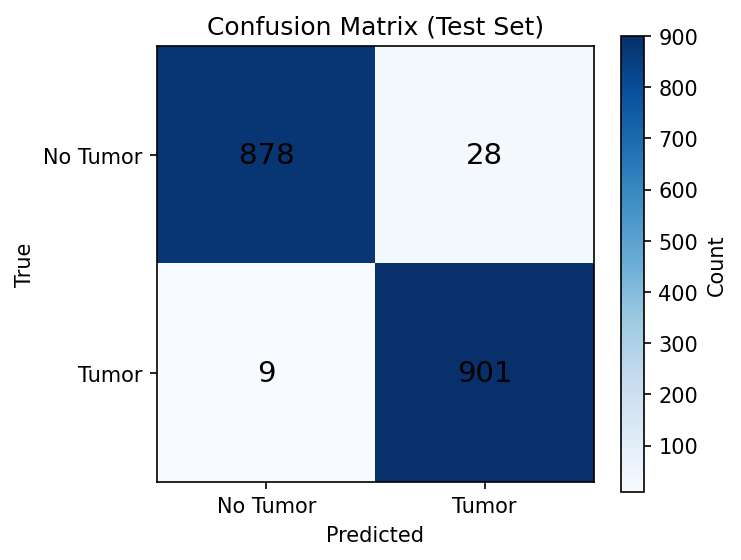
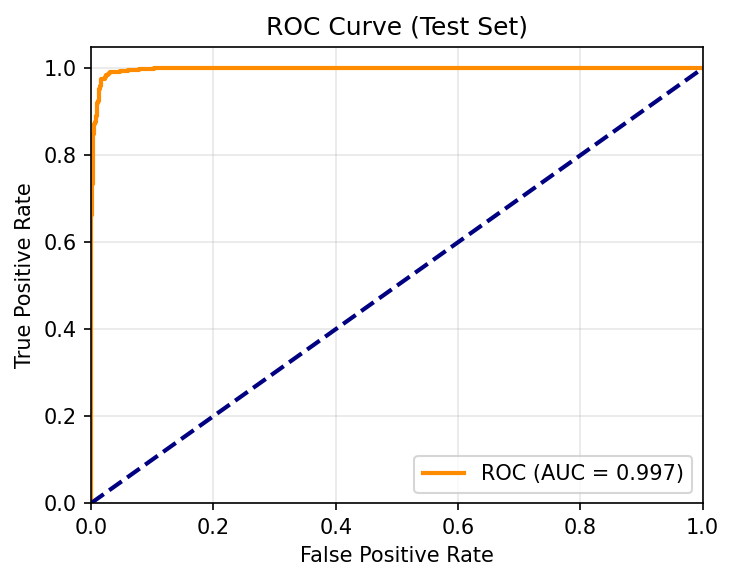
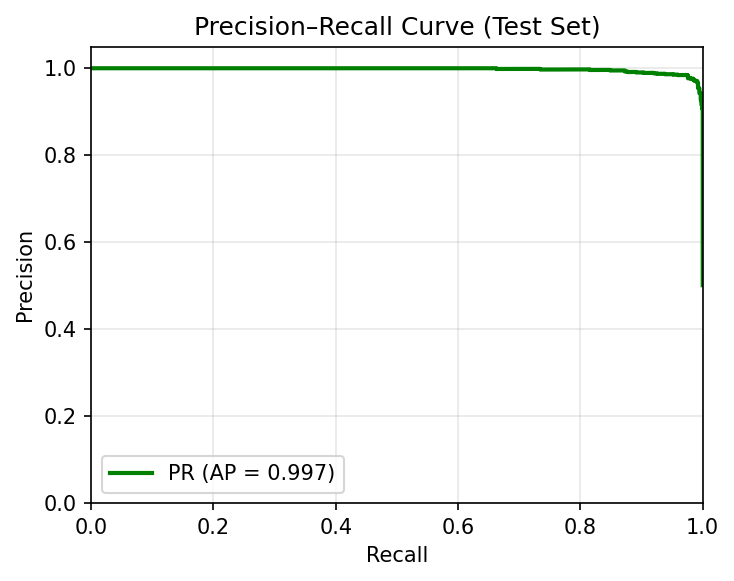
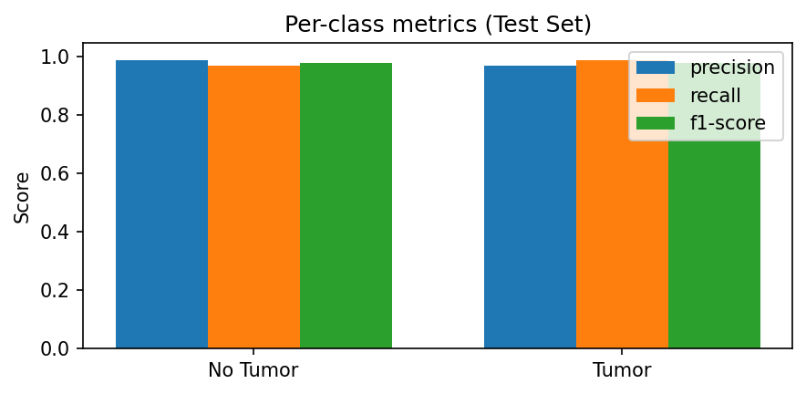
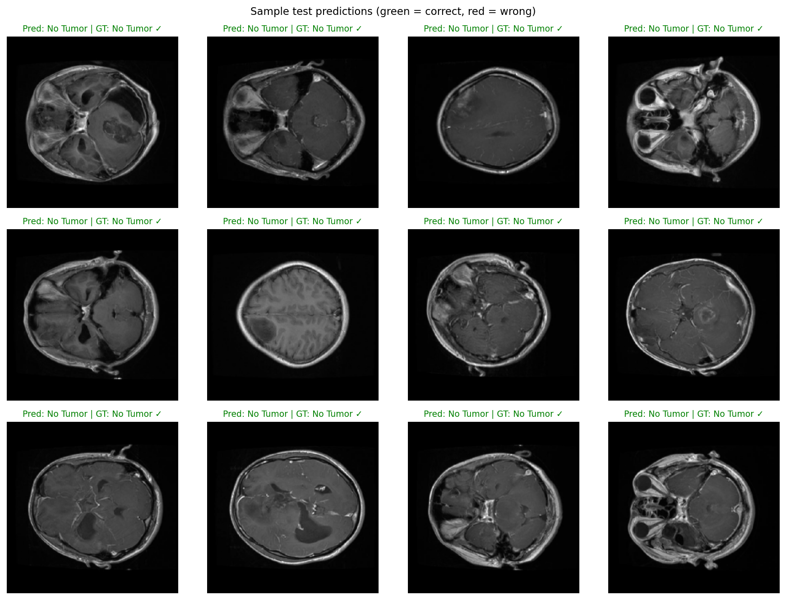

### Brain Tumor Classification with MONAI ResNet-18

This project trains and evaluates a **MONAI ResNet-18** for **binary brain MRI classification** (**Tumor** vs **No Tumor**) using medical-imaging-style preprocessing. It includes a script to create a clean `data/train`, `data/val`, `data/test` folder split from the Mendeley Brain Tumor MRI dataset layout, plus a notebook to generate common evaluation visualizations (confusion matrix, ROC/PR curves, sample predictions).

Recommended workflow:

- Keep the original dataset under `Dataset/` (downloaded separately; not committed).
- Create `data/train`, `data/val`, `data/test` from it with `prepare_dataset_split.py`.
  - **Train/val** come from `Dataset/Training` with a **stratified 85% / 15% split** (configurable via `--val-fraction`).
  - **Test** is the full `Dataset/Testing` set (held out).

---

### 1. Environment setup

Install dependencies (preferably in a virtual environment or conda env):

```bash
pip install -r requirements.txt
```

---

### 2. Prepare the dataset

**Recommended: original dataset + folder layout (no train/test leakage)**

**Dataset citation:**

- Emran, Ahta Shamul Hoque; Akter, Hafija. _Brain Tumor MRI Dataset (Tumor / No Tumor)._ Mendeley Data, v1. DOI: `10.17632/c9rt8d6zrf.1` (https://doi.org/10.17632/c9rt8d6zrf.1)

Place the original dataset under `Dataset/` with this layout:

```text
Dataset/
  Training/
    Tumor/
    No Tumor/
  Testing/
    Tumor/
    No Tumor/
```

Then create train/validation/test folders under `data/` (symlinks by default; no file duplication):

```bash
python prepare_dataset_split.py --dataset-dir Dataset
```

This creates `data/train/`, `data/val/`, and `data/test/` (each with `tumor/` and `no_tumor/`). Images are **symlinked** from `Dataset/` by default (no extra disk usage).

Notes:

- On Windows, symlinks may require admin privileges or Developer Mode. If symlinks fail, use:

```bash
python prepare_dataset_split.py --dataset-dir Dataset --copy
```

- To only print the split sizes (no file operations), use `--dry-run`.

**Train with the folder layout:**

```bash
python train_monai_resnet.py
```

The training script looks for `data/train`, `data/val`, `data/test` first. If not found, it falls back to a single directory with `tumor/` and `no_tumor/` and uses a stratified 70/15/15 split (legacy mode).

**Other options:**

- **Single directory (legacy):** A single root with `tumor/` and `no_tumor/` (e.g. `data/raw_data`) is supported; the script will use a stratified 70/15/15 split. This can cause train/test leakage if that directory was built by merging Training and Testing.
- Supported image extensions: `.png`, `.jpg`, `.jpeg`, `.bmp`.

---

### 3. Train the MONAI ResNet-18

The main training script is `train_monai_resnet.py`. It:

- Loads data from **folder layout** (`data/train`, `data/val`, `data/test`) if present, otherwise from a **single directory** with a 70/15/15 split.
- Applies MONAI transforms (`ScaleIntensity`, `EnsureChannelFirst`, 2D resize, and train-time augmentation).
- Trains a MONAI `resnet18` model.
- Monitors validation accuracy and saves the best model.
- Evaluates once on the held-out test set (classification report, confusion matrix) and saves a sample prediction image.

Run training (after creating the folder layout as in §2):

```bash
python train_monai_resnet.py
```

Key arguments:

- **`--data-dir`**: root for folder layout (default: `data`); script looks for `data-dir/train`, `data-dir/val`, `data-dir/test`.
- **`--data-root`**: fallback single directory with `tumor/` and `no_tumor/` (default: `data/raw_data`), used when folder layout is not found.
- **`--batch-size`**, **`--epochs`**, **`--lr`**, **`--output-dir`**: training options (defaults: 8, 5, 1e-4, `outputs`).

Example with custom options:

```bash
python train_monai_resnet.py --batch-size 16 --epochs 15 --lr 3e-4 --output-dir runs/exp1
```

After training, you will see:

- `best_resnet18.pth` in the output directory (best validation checkpoint).
- `sample_prediction.png` (one test image with predicted vs. ground-truth label).

---

### 4. Evaluate + visualize

Open and run `model_evaluation_visualizations.ipynb` to generate evaluation plots (confusion matrix, ROC curve, PR curve, sample predictions). The notebook will use `data/test` if present, otherwise it falls back to the legacy single-directory split logic.

**Evaluation metrics (held-out test set):**

| Metric                                 | Value              |
| -------------------------------------- | ------------------ |
| Accuracy                               | 97.96%             |
| ROC-AUC                                | 0.9974             |
| Average precision                      | 0.9972             |
| **No Tumor** — Precision / Recall / F1 | 0.98 / 0.98 / 0.98 |
| **Tumor** — Precision / Recall / F1    | 0.98 / 0.98 / 0.98 |

_Values shown above come from the current notebook evaluation for this checkpoint. Accuracy and per-class Precision/Recall/F1 are computed at a fixed decision threshold of 0.5, while ROC-AUC and Average Precision summarize ranking performance across thresholds. Run `model_evaluation_visualizations.ipynb` to recompute and refresh metrics for your run._

**Visualizations produced (saved to `docs/figures/`):**

- Confusion matrix heatmap: `docs/figures/confusion_matrix.png`
- ROC curve: `docs/figures/roc_curve.png`
- Precision–Recall curve: `docs/figures/precision_recall_curve.png`
- Per-class metric bars: `docs/figures/classification_report_bars.png`
- Sample prediction grid: `docs/figures/sample_predictions_grid.png`

**Preview:**











---

### 5. GitHub notes

- Do **not** commit datasets or generated artifacts:
  - `Dataset/`, `data/train/`, `data/val/`, `data/test/`
  - model weights (`*.pth`) and `outputs/`
- A repo-level `.gitignore` is included to prevent accidentally pushing these.

---

### 6. Suggested next steps

- **ROC-AUC + confusion matrix** (the current script already prints a confusion matrix; you can extend it with ROC-AUC and ROC curves).
- **Grad-CAM explainability** to visualize which regions of the MRI drive the model’s decisions.
- **Upgrade to 3D MONAI ResNet** if you move to volumetric MRI data.
